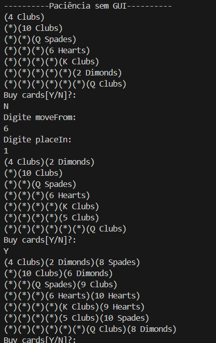

<h1 align="center"> Solitaire Project</h1>

While working with linked lists in C, I had the idea to create a game project to practice the concepts of lists and linked lists.
As I started studying Java and got in touch with the Collections framework, I realized that developing this project in Java would be more reasonable and easier to manage.
I’m still working on it, but you can check out what I’ve done so far.

  

